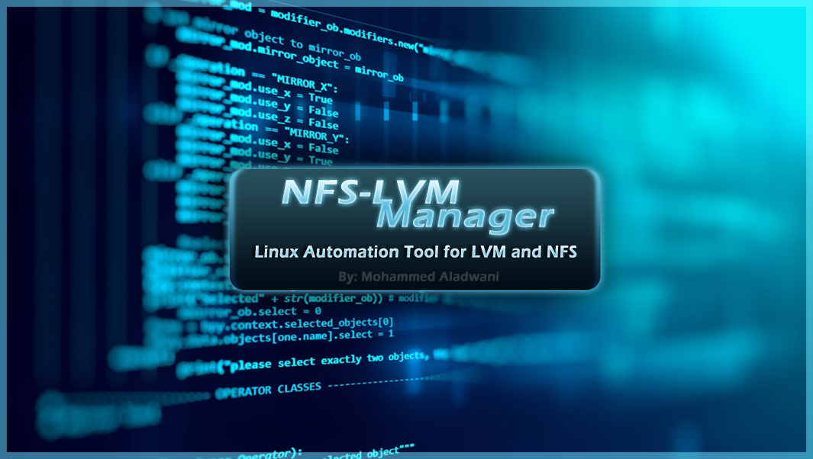

# NFS Logical Volume Management Scripts

These scripts automate the creation and removal of Logical Volumes (LVs) for a specified Volume Group (VG) on an NFS server. The scripts are designed for use with the XFS file system.

## Prerequisites

- These scripts assume that the system is running an NFS server.
- Ensure the `xfsprogs` package is installed on your system.

## Installation

1. Clone the repository to your local machine:

    ```bash
    git clone https://github.com/mk3-v8/nfs-lvm-manager.git
    ```

2. Change into the project directory:

    ```bash
    cd nfs-lvm-manager
    ```

3. Make the scripts executable and copy it to bin:

    ```bash
    chmod +x create.sh
    chmod +x remove.sh
    sudo cp create.sh /bin/create-lv
    sudo cp remove.sh /bin/remove-lv
    export PATH=$PATH:/bin
    ```

## Usage

### 1. Create Logical Volume (create.sh)

#### Syntax:

```bash
create-lv <lv_name> <lv_size>
```

### 2. Remove Logical Volume (remove.sh)
```bash
remove-lv <lv_name>
```
# Notes
- These scripts must be run as root (sudo or as a superuser).
- The create.sh script will create an XFS file system, update the /etc/fstab file, and restart the NFS server.
- The remove.sh script will unmount, remove the LV, update configuration files, and restart the NFS server.

### Feel free to contribute, report issues, or suggest improvements!
